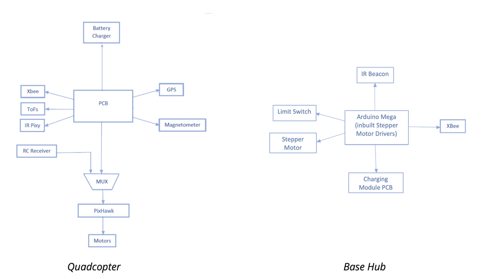
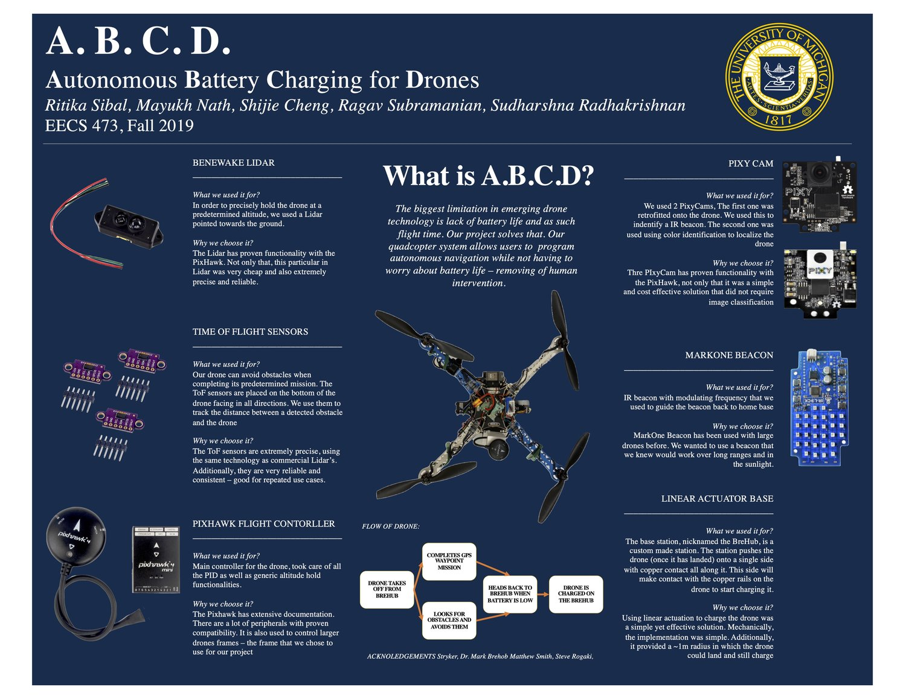
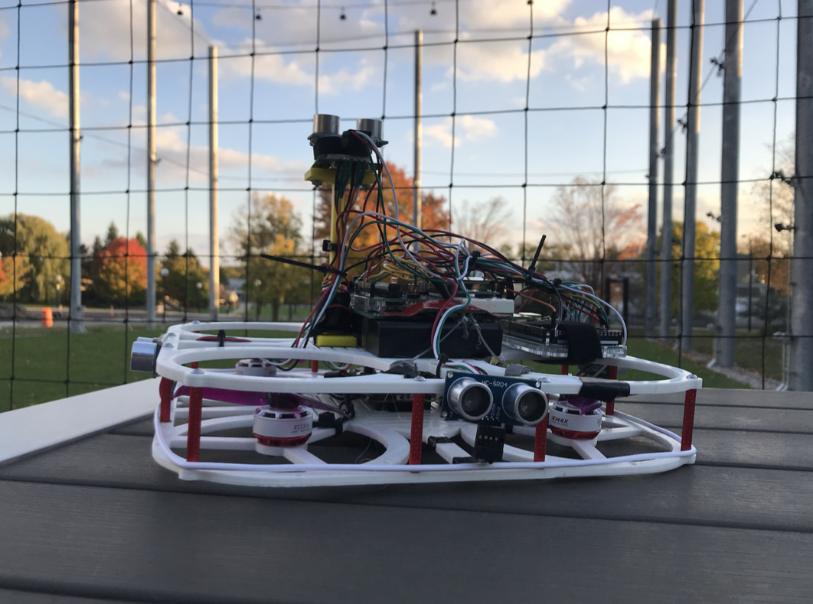
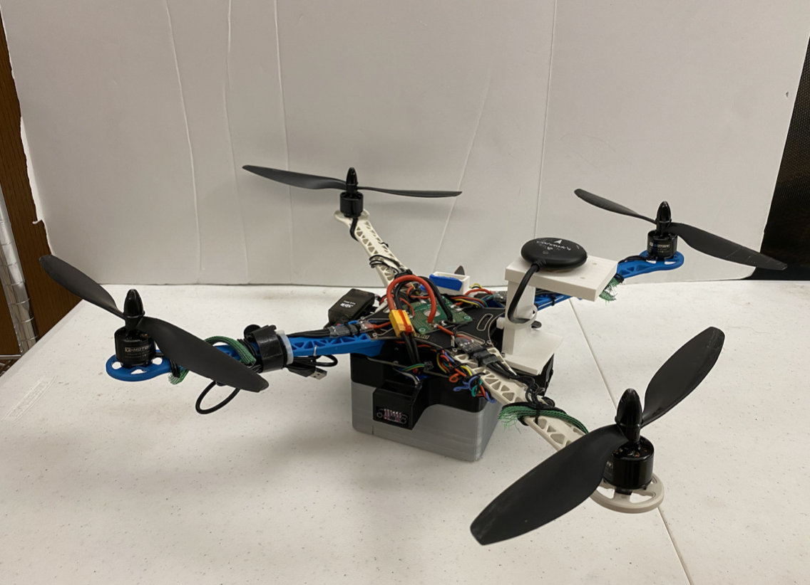

```{r setup, include=FALSE}
knitr::opts_chunk$set(echo = TRUE)
```

# Autonomous Drone for Wildlife {style="text-align:center;"}

***Goal: End-to-end system allowing for truly autonomous drone flight***

We developed a system composed of a quadcopter and a charging station. The quadcopter deploys from the hub, navigates to a user-defined G.P.S. waypoint, returns back to the charging hub when running low on battery, recharges, and repeats the process—free of human intervention. While doing this, the quadcopter will also monitor for static obstacles and avoid them if necessary. Our system consisted of close proximity localisation, allowing the quadcopter to dock into a charging hub.

The primary mission of our project was to create an open source proof-of-concept. In order to have our platform be as accessible by the general public as possible, we were mindful in using hobby grade peripherals. Though these peripherals were complex, they are widely accessible and have well supported documentation.






***Iteration 1***



<video width="640" height="360" controls>
  <source src="assets/ad5.mov" type="video/mp4">
</video>

<br><br>

***Iteration 2***


<iframe width="560" height="315" src="https://www.youtube.com/embed/T78CBEUSOgE?si=RIi5IAtT60-IJrE0" data-external= "1" > </iframe>
