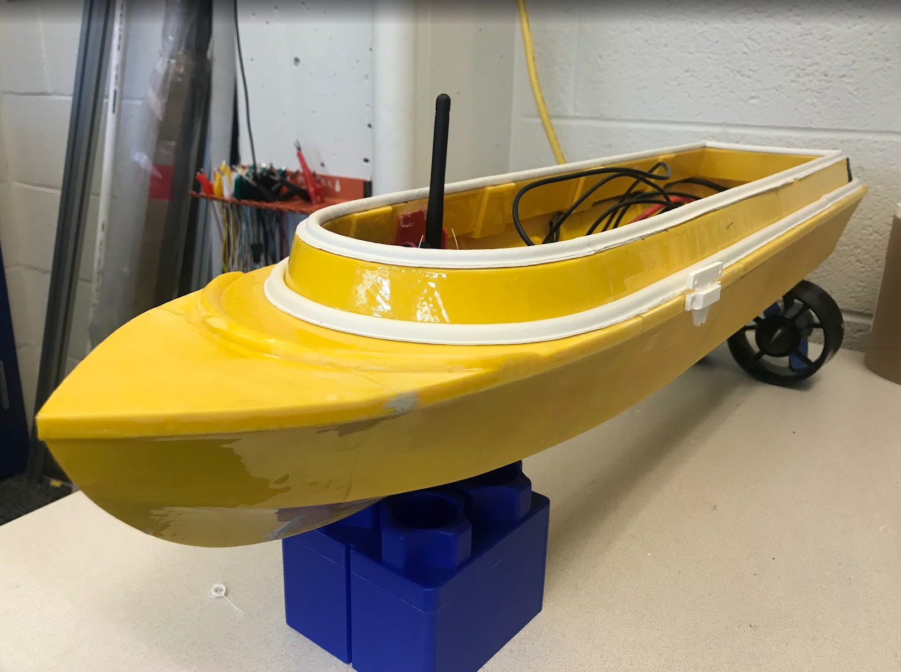

```{r setup, include=FALSE}
knitr::opts_chunk$set(echo = TRUE)
```

# Autonomous Surface Vehicle {style="text-align:center;"}

***Goal: low-cost ASV for ecological monitoring***

This is a 3D printed autonomous surface vehicle. Users can program with a GPS waypoint mission or alternatively control the vehicle remotely.  The vehicle is equipped with data logging capabilities and depth, temperature and pressure sensors. A bathymetry map of the local river was created. 



<iframe width="560" height="315" src="https://www.youtube.com/embed/T0ZLcxV9U6M?si=K5RrIdj29gJSGPaG" data-external= "1" > </iframe>