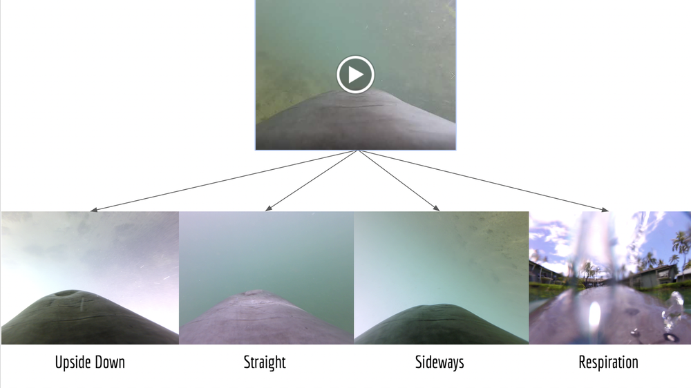
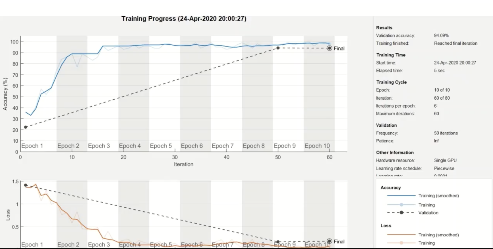

```{r setup, include=FALSE}
knitr::opts_chunk$set(echo = TRUE)
```

# Dolphin swimming (computer vision) {style="text-align:center;"}

This was a personal project I embarked upon using the same data and problem statement as above Instead of using IMU data, I used computer vision to draw swimming state conclusions.

I converted the video stream from the onboard camera to single frames at a 5 fps rate. From there, I manually grouped the frames into different categories (pictured below). As you can see here, there are distinct lighting characteristics in each of the states, making it a good candidate for a computer vision model.



I chose a CNN model for my neural network. After categorizing the data, the model was trained and we achieved a ***95% accuracy***! 

