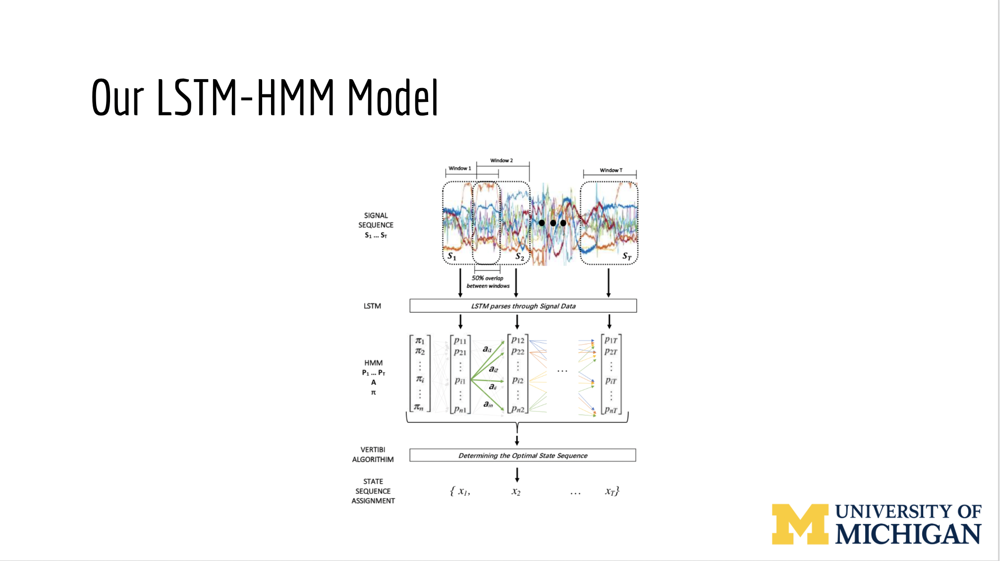
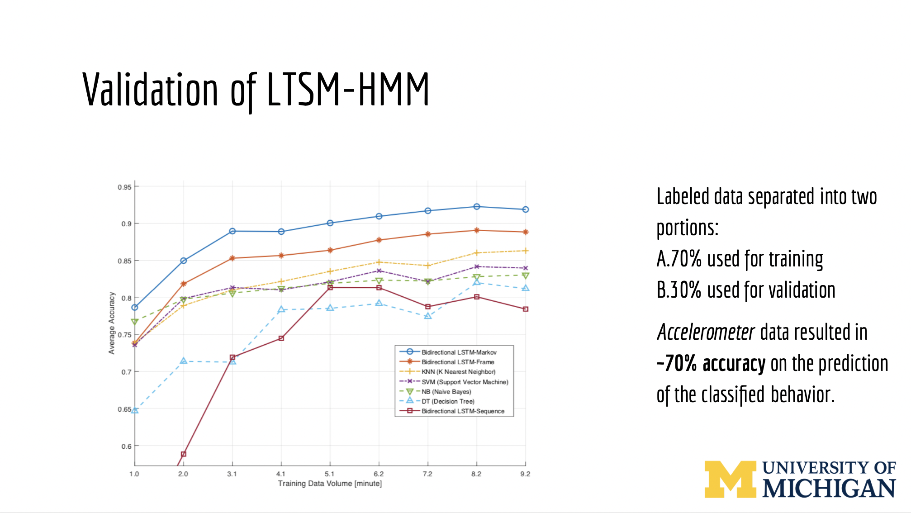
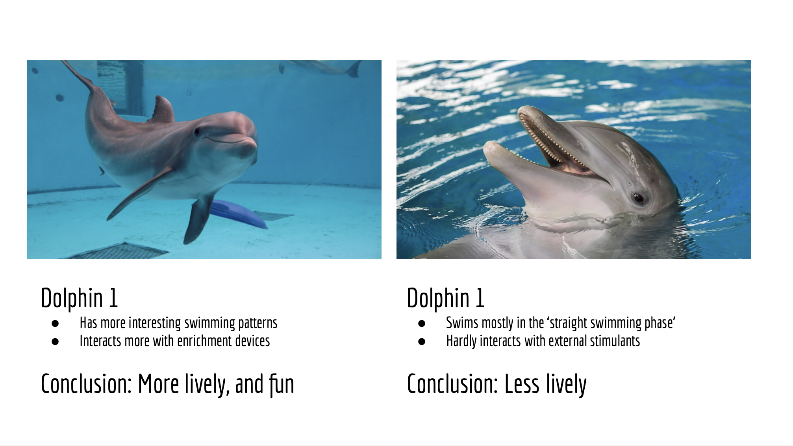

```{r setup, include=FALSE}
knitr::opts_chunk$set(echo = TRUE)
```

# Dolphin swimming (IMU) {style="text-align:center;"}

***Goal: Implement a model to predict the behaviors of dolphins with a high degree of certainty based on IMU data collected from dolphins wearing bio-logging tags.*** [Read the paper here!](https://asmedigitalcollection.asme.org/lettersdynsys/article-abstract/1/2/021002/1081846/Bidirectional-LSTM-Recurrent-Neural-Network-Plus?redirectedFrom=fulltext)

For this case study, we monitored dolphins in an enclosed sanctuary in Hawaii. Data was provided by the Barton Research group and included camera data (overhead and on body) and IMU data. We decide to label 4 behaviors (straight, sideways, upside-down and respiration).


I developed an interactive MATLAB GUI to ease the data collection process and build a valid and accurate training set. Based on camera data I tagged data based on what the dolphins doing.


Once a good training data set was achieved, we developed a hybrid machine learning model (pictured below) 



We then trained the model (top) and created a state model (bottom) describing the probability of making state transitions, providing insight into the dolphin’s decision making.




With this data and process, we can actually draw larger biological conclusions such as dolphin personality types!



