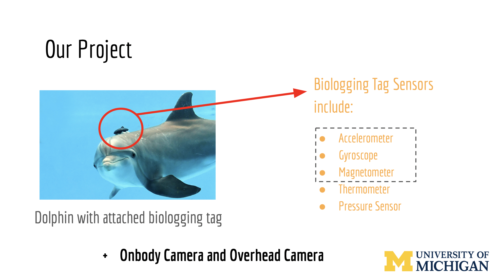
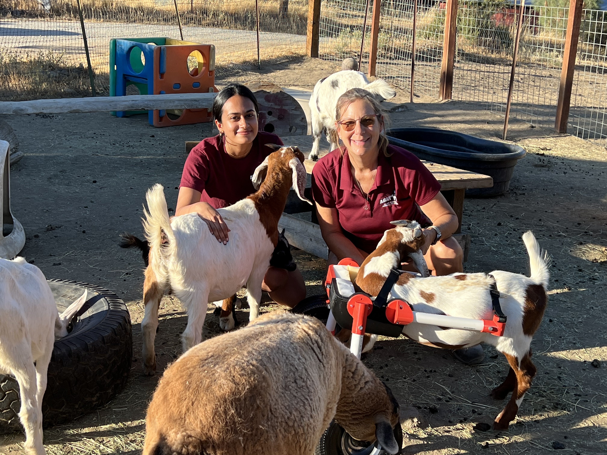

```{r setup, include=FALSE}
knitr::opts_chunk$set(echo = TRUE)
```

<li class="masthead__menu-item">
  <a href="ritikasibal.github.io/Untitled.html">Research</a>
</li>
        
<div style="display: flex; align-items: flex-start; gap: 20px; flex-wrap: wrap;">


<div style="flex: 1; min-width: 300px;">
<h2 style="margin-top: 0; padding-top: 0;">Welcome!</h2>

I graduated in 2020 from the University of Michigan with a ***bachelor’s in computer engineering***. After graduating I worked as an embedded engineer at Apple and later Atomic Technologies. I recently graduated from Boston University with a research-based ***master’s in ecology, evolution, and behavior***.

This website showcases my research experience, personal projects, and interests. If you would like to contact me, feel free to reach out at [ritikasibal2@gmail.com](mailto:ritikasibal2@gmail.com)!

</div>
</div>

<br><br>

## Wildlife x Technology Work

### Orangutan pose estimation {style="text-align:center;"}

***Goal: develop a 2D pose estimation tool to automatically detect joint position in videos of wild orangutans.***

Publication detailing the full method coming soon! In the mean time, here are some example videos of the model in action!

<iframe width="560" height="315" src="https://www.youtube.com/embed/zTDKKoYHvb8?si=Uy2mhH12xGjW5T1S" data-external= "1" > </iframe>

<iframe width="560" height="315" src="https://www.youtube.com/embed/lWTq4YX8zuA" data-external= "1" > </iframe>

<br>

### Dolphin swimming (IMU) {style="text-align:center;"}

[Read the paper here!](https://asmedigitalcollection.asme.org/lettersdynsys/article-abstract/1/2/021002/1081846/Bidirectional-LSTM-Recurrent-Neural-Network-Plus?redirectedFrom=fulltext)

***Goal: Implement a model to predict the behaviors of dolphins with a high degree of certainty based on IMU data collected from dolphins wearing bio-logging tags.***

For this case study, we monitored dolphins in an enclosed sanctuary in Hawaii. Data was provided by the Barton Research group and included camera data (overhead and on body) and IMU data. We decide to label 4 behaviors (straight, sideways, upside-down and respiration).




I developed an interactive MATLAB GUI to ease the data collection process and build a valid and accurate training set. Based on camera data I tagged data based on what the dolphins doing.


Once a good training data set was achieved, we developed a hybrid machine learning model (pictured below) 


We then trained the model (top) and created a state model (bottom) describing the probability of making state transitions, providing insight into the dolphin’s decision making.


With this data and process, we can actually draw larger biological conclusions such as dolphin personality types!


<br>

### Dolphin swimming (computer vision) {style="text-align:center;"}

This was a personal project I embarked upon using the same data and problem statement as above Instead of using IMU data, I used computer vision to draw swimming state conclusions.

I converted the video stream from the onboard camera to single frames at a 5 fps rate. From there, I manually grouped the frames into different categories (pictured below). As you can see here, there are distinct lighting characteristics in each of the states, making it a good candidate for a computer vision model.


I chose a CNN model for my neural network. After categorizing the data, the model was trained and we achieved a ***95% accuracy***! 


<br><br>

## Embedded Projects

<br><br>

## Animal Projects

### A custom wheelchair for rocky! {style="text-align:center;"}

***A affordable and easily adaptable wheelchair for a growing, adventurous lamb*** 



When I met Rocky, he was a 3 month old kid. He clearly had an adventurous spirit but had a hard time moving around. Inspired by YouTube videos of cute dogs in wheelchairs, I tried to build Rocky his own by utilizing my 3D printing knowledge.

Sheila, the founder of Alma Bonita Animal Rescue, was all for it! She thought it would be beneficial to have a low cost, adaptable wheelchair while Rocky fully matured. 

<video width="640" height="360" controls>
  <source src="assets/rockywheelchair3.mov" type="video/mp4">
</video>

<br>

For those interested in replicating something similar, here is a bill of materials and links to all the 3D models I designed:

***CAD files***

* WC body right
* WC body left
* WC additional wheel connector
* Stabilising joint connector (1 inch)
* Stabilising joint connector (3/4 inch)
* WC body joint back (top)
* WC body joint back (bottom)
* Strap joint connector
* WC body joint front

***Materials***

* 1 inch PVC pipes (adjustable depending on height and length)
* 3/4 inch PVC pipes (adjustable depending on height and length)
* 2 inch thick foam
* Webbing and buckles
* Thick, heavy duty, outdoor wheels
* 10-32 x 2 in.  screws and nuts
* 5/8 inch screws, nuts and washers (for wheels)
* 5/6 inch screws, nuts and washers (for pipe connecting wheels)
* 10-32 screws and nuts to attach all 3D printed parts together 
* 5/16 in spade bit
* 5/8 in spade bit
* Pilot drill bit set
* Velcro Sticky Back Strips 


<br>


<br><br>

## Publications 

Sibal, Ritika, Liew, Evelyn, Susanto Tri Wahyu, Betke Margrit, Knott, Cheryl. “DeepHutan: A novel, robust computer vision model for wild Borean orangutan (Pongo pygmaeus wurmbii) pose estimation”. ***Manuscript in preparation***. Expected July 2025

Sibal, Ritika, Kane, Erin, Knott, Cheryl. “The Ontogeny of Positional Behavior in Wild Bornean Orangutans (Pongo pygmaeus wurmbii)”. ***Manuscript in preparation***. Expected Aug 2025

[Sibal, Ritika, Zhang, Ding, Shorter, Alex, Barton, Kira. “Bidirectional LSTM Recurrent Neural Network Plus Hidden Markov Model For Wearable Sensor Based Dynamic State Estimation”, Dynamic Systems and Control Journal. May 2019](https://asmedigitalcollection.asme.org/lettersdynsys/article-abstract/1/2/021002/1081846/Bidirectional-LSTM-Recurrent-Neural-Network-Plus?redirectedFrom=fulltext)

[Sammons, Patrick, Bollieni, Sahit, Sibal, Ritika, and Barton, Kira. “Temperature and Humidity Variation Effect on Process Behavior in Electrohydrodynamic Jet Printing of a Class of Optical Adhesives”, Solid Free Form Journal. August 2017](https://repositories.lib.utexas.edu/server/api/core/bitstreams/db968022-f316-452e-a91e-e9d60f9d0d39/content)

<br><br>

## Resume

<iframe src="assets/CV.pdf#toolbar=0&navpanes=0&scrollbar=0" width="100%" height="800px" style="border: none;"></iframe>


