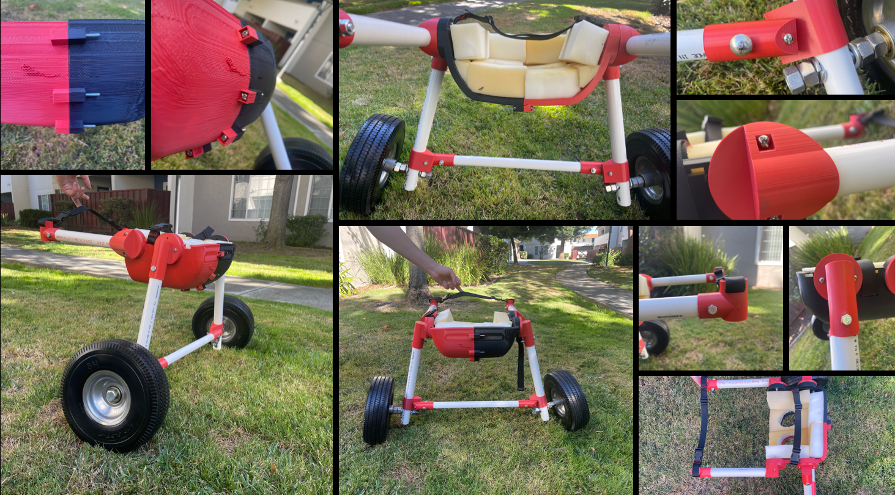

```{r setup, include=FALSE}
knitr::opts_chunk$set(echo = TRUE)
```

# A custom wheelchair for rocky! {style="text-align:center;"}

***A affordable and easily adaptable wheelchair for a growing, adventurous lamb*** 


When I met Rocky, he was a 3 month old kid. He clearly had an adventurous spirit but had a hard time moving around. Inspired by YouTube videos of cute dogs in wheelchairs, I tried to build Rocky his own by utilizing my 3D printing knowledge.

Sheila, the founder of Alma Bonita Animal Rescue, was all for it! She thought it would be beneficial to have a low cost, adaptable wheelchair while Rocky fully matured. 

<video width="640" height="360" controls>
  <source src="assets/rockywheelchair3.mov" type="video/mp4">
</video>

<br>

For those interested in replicating something similar, here is a bill of materials and links to all the 3D models I designed:

***CAD files***

* WC body right
* WC body left
* WC additional wheel connector
* Stabilising joint connector (1 inch)
* Stabilising joint connector (3/4 inch)
* WC body joint back (top)
* WC body joint back (bottom)
* Strap joint connector
* WC body joint front

***Materials***

* 1 inch PVC pipes (adjustable depending on height and length)
* 3/4 inch PVC pipes (adjustable depending on height and length)
* 2 inch thick foam
* Webbing and buckles
* Thick, heavy duty, outdoor wheels
* 10-32 x 2 in.  screws and nuts
* 5/8 inch screws, nuts and washers (for wheels)
* 5/6 inch screws, nuts and washers (for pipe connecting wheels)
* 10-32 screws and nuts to attach all 3D printed parts together 
* 5/16 in spade bit
* 5/8 in spade bit
* Pilot drill bit set
* Velcro Sticky Back Strips 


<br>

